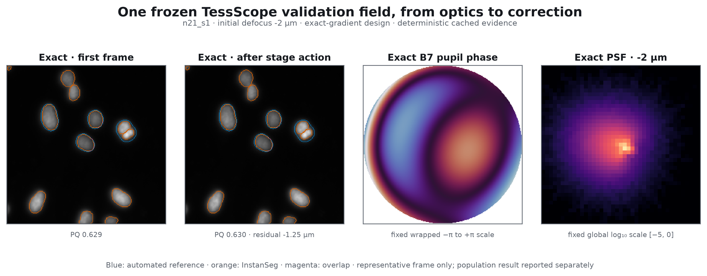
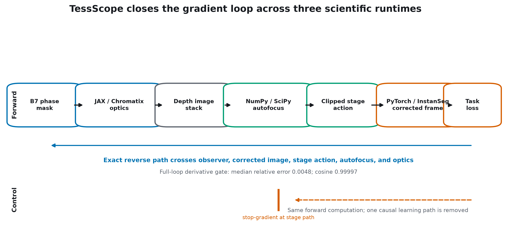

# TessScope

**Tesseract Hackathon 2026 · Track 05 — Differentiable graphics & rendering**

TessScope differentiates through a closed-loop fluorescence microscope: JAX/Chromatix
forms an image, NumPy/SciPy predicts a focus correction, PyTorch/InstanSeg scores the
biological result, and Tesseract carries exact gradients across all three runtimes.



> **Supported validation claim.** Exact closed-loop gradients improve corrected
> panoptic quality (PQ) by `+0.006259` over a forward-identical stopped-gradient system;
> 95% well-bootstrap CI `[+0.000670, +0.011547]` across 27 hard-density validation wells.

PQ is panoptic quality on a 0–1 scale, not percent accuracy. All v2 evidence is
validation-only, the locked BBBC006 test remains sealed, and no physical microscope has
validated this system.

## Judge it in under two minutes

The judge experience is a dependency-free cached replay. It does not download the
approximately 2.5 GB BBBC006 subset, load model weights, retrain, or run live inference.

```bash
python3 scripts/serve_demo.py
```

The command validates the bundle, opens `http://127.0.0.1:8765/`, and binds only to the
local machine. A non-interactive integrity check is also available:

```bash
python3 scripts/serve_demo.py --check
```

The 12.4 MiB replay pack is traced to frozen validation sources and exposes the exact,
stopped-gradient, and strong piecewise comparison together. See the
[technical brief](output/pdf/tessscope-technical-brief.pdf) and the
[3.5-minute caption-led demo](outputs/video/tessscope-demo.mp4) for the submission-ready
summary.

## Results that matter

The primary v2.4 checkpoint is the frozen balanced exact design at step 14.

| Question | Result | Interpretation |
|---|---:|---|
| First-frame hard off-focus PQ | `0.492192` | Image before the predicted stage move |
| Corrected hard off-focus PQ | **`0.552295`** | One bounded predicted correction later |
| Hard frames improved | `74.7%` | Corrected PQ exceeds first-frame PQ |
| Focus error | `1.267923 µm` MAE | `98.89%` signed-direction accuracy |
| Exact vs. matched stopped gradient | **`+0.006259` PQ** | CI `[+0.000670, +0.011547]`; causal path supported |
| Exact vs. piecewise-028 | `+0.001285` PQ | CI `[−0.001719, +0.004800]`; not significant |

The exact and stopped systems have identical forward computation (`0.0` measured
difference). Only the backward path through the autofocus action is removed. This makes
their paired difference a direct test of whether the feedback gradient is useful—not
merely whether the architecture contains a focus module.

The stronger claim was not earned: exact optimization did **not** significantly beat
piecewise-028, and its first-frame PQ missed the frozen segmentation tolerance by
`0.000295`. Follow-up v2.5 and v2.6 experiments produced no promotable candidate. Those
negative results remain part of the record in the
[research history](docs/RESEARCH_HISTORY.md).


## Why Tesseract is load-bearing



| Served component | Native stack | Role in the loop | Reverse path |
|---|---|---|---|
| Optics Tesseract | JAX + Chromatix | Phase pupil and depth-dependent fluorescence image formation; called for both exposures | JAX VJP through pupil and residual depth |
| Autofocus Tesseract | NumPy + SciPy | Spectral features, regularized signed-z ridge fit, bounded stage action | Hand-derived FFT/feature VJP plus implicit ridge-solve VJP |
| Observer Tesseract | PyTorch + InstanSeg | Frozen nucleus task loss on the first and corrected frames | PyTorch autograd input VJP |

Tesseract provides the typed service boundaries and differentiable calls that let each
scientific component stay in its native framework. `tesseract-jax` exposes those remote
calls as one JAX-differentiable program, so one objective returns one pupil gradient
through JAX → SciPy → JAX → PyTorch without reimplementing the models in a single stack.

The core composition is readable in
[`src/tessscope/v2_3/closed_loop.py`](src/tessscope/v2_3/closed_loop.py). The three served
APIs are:

- [`services/v2_3/optics/tesseract_api.py`](services/v2_3/optics/tesseract_api.py)
- [`services/v2/autofocus/tesseract_api.py`](services/v2/autofocus/tesseract_api.py)
- [`services/v2_1/observer/tesseract_api.py`](services/v2_1/observer/tesseract_api.py)

The complete served derivative passed central differences with median relative error
`0.004802`, cosine agreement `0.999967`, and exact/stopped forward parity `0.0`.

## The closed loop

1. A bounded seven-parameter phase pupil forms an initial seven-plane fluorescence
   stack through calibrated JAX/Chromatix optics.
2. The SciPy autofocus Tesseract extracts content-normalized spectral features and fits
   signed depth from two support fields.
3. It predicts and clips a microscope-stage action to `[-6, +6] µm`.
4. The action changes residual depth; the same pupil forms a corrected exposure.
5. A frozen InstanSeg observer scores first- and corrected-frame nucleus utility.
6. Exact VJPs cross all service boundaries and optimize the pupil for the full loop.


## Evidence protocol

- **Dataset:** BBBC006v1 U2OS fluorescence z-stacks, Hoechst channel only, planes z13–z19
  (`−6` to `+6 µm` around z16 in `2 µm` steps).
- **Split unit:** well. All planes and both sites from one well remain in one deterministic
  split: 288 training, 48 validation, and 48 sealed test wells.
- **Hard evaluation:** the same 45 registration-valid validation wells for every frozen
  design; the preregistered primary-density subset contains 27 wells.
- **Uncertainty:** 2,000 deterministic paired bootstrap replicates resampling wells, not
  individual frames.
- **Reference labels:** official automated CellProfiler-derived z16 instance labels;
  they are not manual ground truth.
- **Selection discipline:** checkpoint selection occurred before hard-label evaluation;
  the locked BBBC006 test was never opened because the preregistered promotion gates failed.

Every displayed value maps to a source JSON pointer and SHA-256 in
[`outputs/demo/traceability-manifest.json`](outputs/demo/traceability-manifest.json).
The frozen public claim contract is
[`configs/demo/claim-matrix.yaml`](configs/demo/claim-matrix.yaml).

## Reproduce

### Fast public path

The cached judge replay above needs only Python's standard library. Its manifest records
that it is a replay rather than live inference.

### Code checks

TessScope targets Python `3.12` and uses the committed `uv.lock`:

```bash
uv sync --frozen
uv run ruff check .
uv run pytest -q
python3 scripts/serve_demo.py --check
```

### Scientific path

The full path requires network access for official external assets, roughly 2.5 GB for
the extracted BBBC006 W1 subset, about 15 MB for the frozen InstanSeg bundle, three local
Tesseract services, and substantially more compute than the cached replay. It never
requires Docker. Exact commands, output-isolation options, expected checks, and
troubleshooting are in [`docs/FULL_REPRODUCTION.md`](docs/FULL_REPRODUCTION.md).

The measured nine-run v2.3 optimization core took about 16 minutes in aggregate on the
project MacBook Air M2 after service warm-up; raw-data preparation and the 45-well hard
evaluation are the longer stages and should be allowed substantially more time.

## Repository map

```text
src/tessscope/       scientific code and cross-runtime composition
services/            Tesseract API entry points
scripts/             gated experiments, audits, demo and media builders
configs/             preregistered contracts and frozen selections
data/manifests/      official asset provenance, checksums and splits
artifacts/runs/      compact machine-readable evidence (large inputs excluded)
outputs/demo/        static judge experience, figures and validation replay
outputs/video/       caption-led submission video and production notes
output/pdf/          editable technical-brief source and compiled PDF
tests/               parity, derivative, scientific and judge-path checks
```

## Scope and limitations

- This is an in-silico optical co-design prototype, not a clinical system.
- No phase mask has been fabricated or tested on a physical microscope.
- The judge demo replays cached evidence and does not claim live inference.
- The supported causal result is validation-only; the locked BBBC006 test remains sealed.
- Exact optimization did not significantly outperform the strongest piecewise baseline.
- v2.5 constrained B11 and v2.6 two-mask follow-ups are complete negative experiments,
  not hidden unfinished positive runs.

## Hackathon fit and references

TessScope enters **Track 05 — Differentiable graphics & rendering** because its central
artifact is a differentiable fluorescence image-formation and feedback loop. Tesseract
is essential to the result: it composes independently implemented JAX, SciPy, and
PyTorch components while preserving exact end-to-end derivatives.

- [Tesseract Hackathon 2026](https://pasteurlabs.ai/tesseract-hackathon-2026/)
- [Tesseract differentiable pipelines](https://docs.pasteurlabs.ai/projects/tesseract-core/stable/content/how-to/pipelines/)
- [BBBC006](https://bbbc.broadinstitute.org/BBBC006) — Ljosa et al., *Nature Methods*, 2012
- [Chromatix](https://github.com/chromatix-team/chromatix) — Deb et al., bioRxiv 2025,
  DOI `10.1101/2025.04.29.651152`
- [InstanSeg](https://github.com/instanseg/instanseg) — Goldsborough et al., arXiv 2024,
  DOI `10.48550/arXiv.2408.15954`

TessScope code and original documentation are licensed under Apache License 2.0. External
datasets, models, libraries, fonts, and trademarks retain their own terms; see
[`LICENSE`](LICENSE), [`NOTICE`](NOTICE), and
[`THIRD_PARTY_NOTICES.md`](THIRD_PARTY_NOTICES.md). Citation metadata is available in
[`CITATION.cff`](CITATION.cff).
