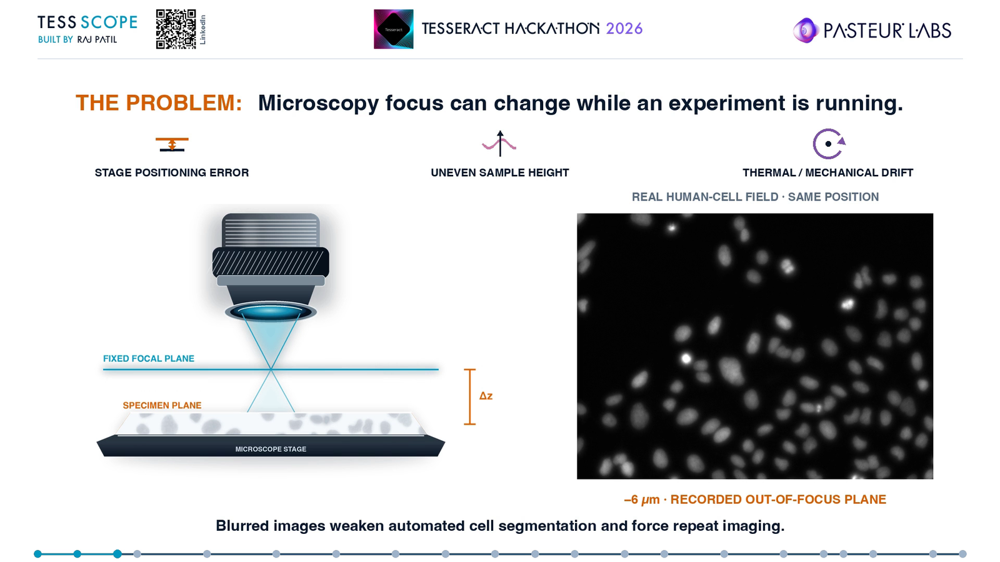
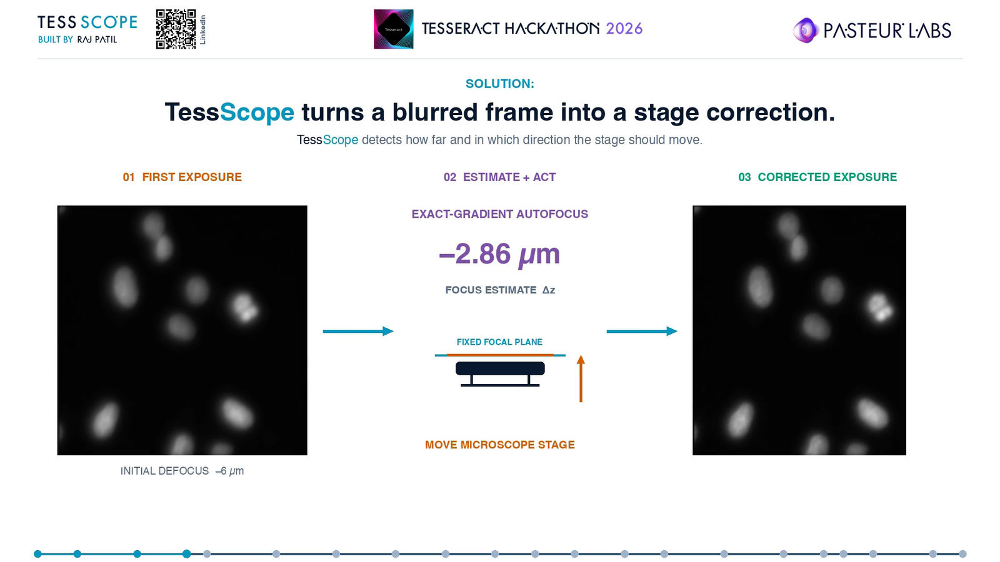
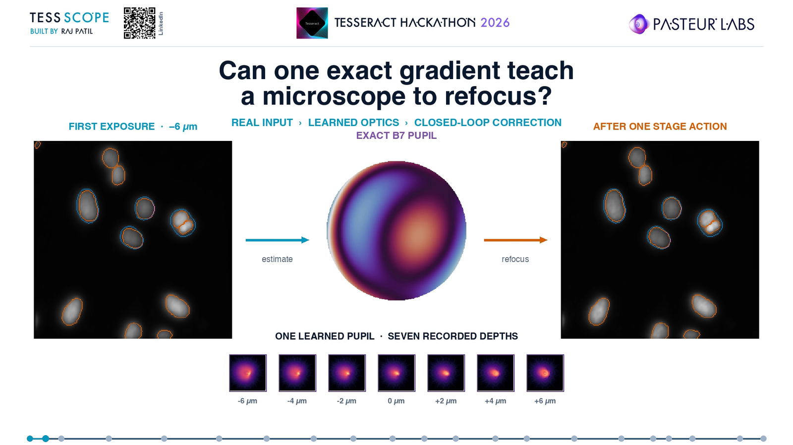
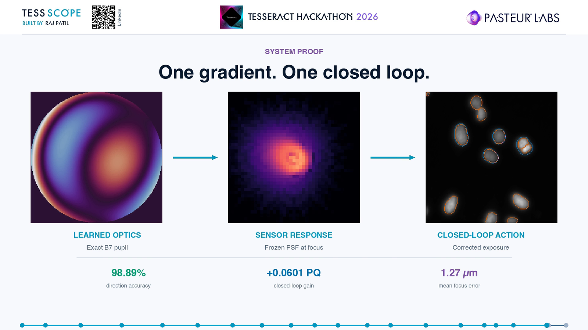
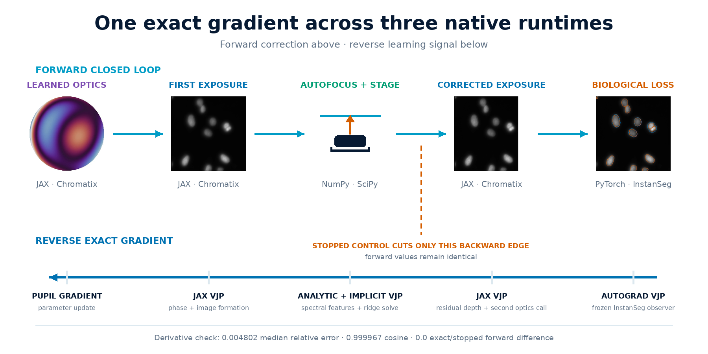
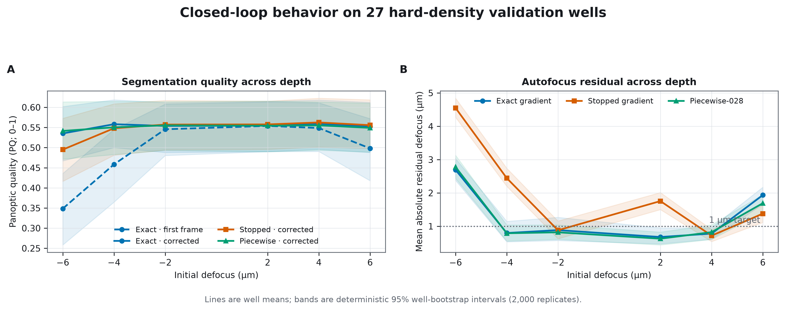
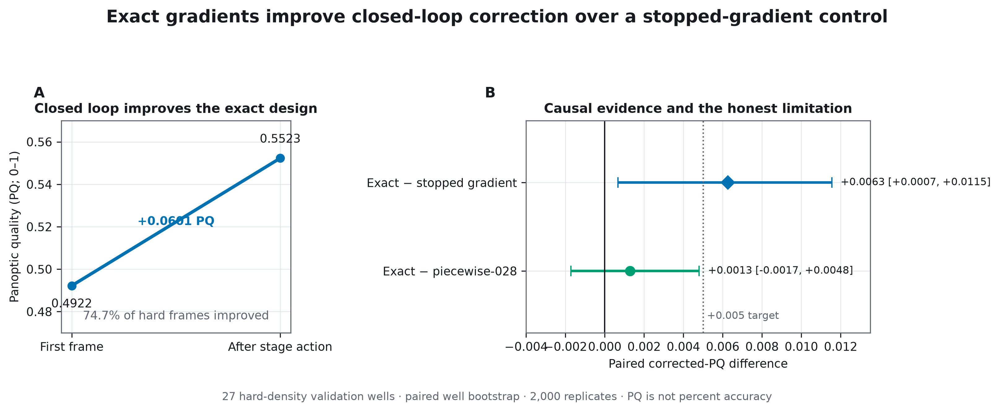
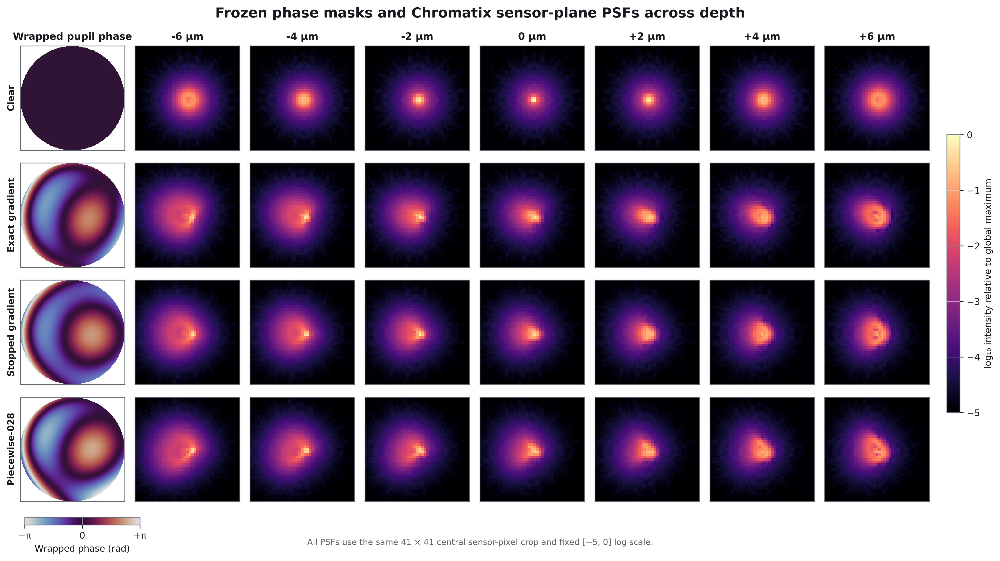
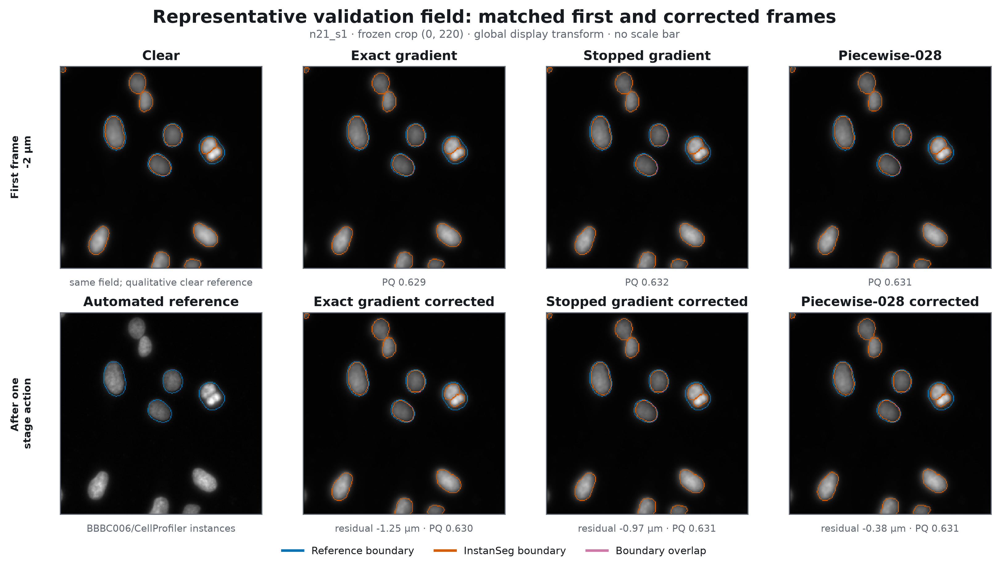

# TessScope

[](https://www.python.org/downloads/release/python-3120/)
[](LICENSE)
[](https://pasteurlabs.ai/tesseract-hackathon-2026/)
[](outputs/release/GO-NO-GO.md)

**Tesseract Hackathon 2026 · Track 05 — Differentiable graphics and rendering**

> **TessScope is an in-silico closed-loop fluorescence microscopy prototype that learns a
> phase-only pupil, estimates signed defocus, commands a bounded stage correction, and optimizes
> the complete imaging loop for nucleus-segmentation quality.**

TessScope connects JAX/Chromatix optics, NumPy/SciPy autofocus, and a frozen
PyTorch/InstanSeg observer. Tesseract keeps every component in its native scientific stack while
carrying one exact gradient through the full feedback loop.

> **Supported validation result:** exact closed-loop gradients improve corrected panoptic quality
> by **+0.006259 PQ** over a forward-identical stopped-gradient system, with a 95% paired
> well-bootstrap interval of **[+0.000670, +0.011547]** across 27 hard-density validation wells.

All reported evaluation evidence is validation-only. PQ is panoptic quality on a 0–1 scale, not
percent accuracy. The locked BBBC006 test split remains sealed, and no physical microscope has
validated the system.

## The problem

Microscopy focus can change while an experiment is running. Stage-positioning error, uneven sample
height, and thermal or mechanical drift move the specimen away from the focal plane. The resulting
blur is not merely cosmetic: it weakens automated nucleus analysis and can force researchers to
repeat imaging or correct focus manually.



For TessScope, the optical-design challenge is stricter than making an image look sharp. The pupil
must preserve useful cell structure while encoding enough signed depth information for the
controller to know both **how far** and **in which direction** the stage should move.

## The solution

TessScope turns a blurred frame into a bounded stage correction:

1. A learned seven-parameter phase pupil forms the first fluorescence exposure.
2. Spectral autofocus estimates signed defocus from the sensor image.
3. The controller clips the stage command to the calibrated range of −6 to +6 µm.
4. The same pupil forms a second exposure at the residual depth.
5. A frozen nucleus observer scores the biological utility of both exposures.
6. One exact reverse signal updates the pupil through the complete loop.



## Watch the 93-second system demo

[](https://youtu.be/u5QRV6fVLQg)

**[▶ Watch on YouTube](https://youtu.be/u5QRV6fVLQg)** ·
[Direct MP4 backup](outputs/video/linkedin/tessscope-end-to-end-demo-polished-v23.mp4)

The video uses frozen TessScope evidence and real BBBC006 microscopy fields. Its animations reveal
the recorded curves and values; they do not synthesize scientific results.

## Why TessScope belongs in this hackathon

| Judging question | TessScope answer |
|---|---|
| **Does it compose across a real boundary?** | Three served Tesseracts cross JAX/Chromatix → NumPy/SciPy → JAX/Chromatix → PyTorch/InstanSeg boundaries inside one feedback loop. |
| **Do gradients do real work?** | The exact system beats a forward-identical stopped-gradient control by +0.006259 corrected PQ with a positive paired-well bootstrap interval. |
| **Why is Tesseract load-bearing?** | It preserves the native implementation and derivative strategy of every component while exposing the composition as one differentiable JAX program. |
| **Is the application real?** | The system tackles focus correction for fluorescence nucleus imaging using real BBBC006 cell fields and a frozen task observer. |
| **Is there technical depth?** | The project includes calibrated image formation, a served implicit ridge VJP, a PyTorch observer VJP, finite-difference derivative gates, causal controls, and pre-registered evaluation. |
| **Can judges reproduce it?** | A dependency-free cached replay checks public evidence in seconds; code verification and the complete scientific path are documented separately. |

## One closed-loop system



### Forward computation

The v2.3 loop receives two autofocus support fields and one supervised query field. The first optics
call renders seven calibrated depths for all three fields. Autofocus learns a signed-depth ridge
model from the support fields, predicts the query offsets, and returns a bounded stage action. A
second call to the same optics Tesseract renders the query field at the resulting residual depth.
The frozen observer then returns first- and final-exposure task losses.

### Reverse computation

The observer sends an input VJP from PyTorch to the corrected JAX optics call. The residual-depth
signal continues through the SciPy autofocus service, whose custom reverse rule differentiates its
spectral features analytically and its ridge solve implicitly. The signal finally crosses the first
JAX/Chromatix call and reaches the phase-pupil parameters.

## Methodology

Every equation below corresponds to the frozen implementation or experiment contract. The README
does not introduce a separate theoretical model.

### 1. Bounded learned pupil

The exact design uses seven RMS-normalized Zernike modes, Noll 5 through 11. Seven unconstrained
parameters are mapped into an open 2.5-radian RMS coefficient ball:

```math
\mathbf{c}(\mathbf{v})
=
b\,\frac{\mathbf{v}}{\sqrt{1+\lVert\mathbf{v}\rVert_2^2}},
\qquad
b=2.5\ \mathrm{rad},
\qquad
\mathbf{v}\in\mathbb{R}^{7}.
```

The resulting phase pupil modulates a Chromatix objective point source before Fourier propagation.
The sensor-plane PSF is normalized to unit energy and integrated over square sensor pixels.

### 2. Fluorescence image formation

For object field $O$, depth $z$, and pupil parameters $\theta$, the noiseless sensor rate is
the object convolved with the depth-dependent PSF:

```math
I_z(\theta) = O * h_z(\theta).
```

The served optics model then applies the frozen exposure calibration and noise model. Both
exposures use the same object and the same learned pupil; only the residual depth changes.

### 3. Signed-depth autofocus and stage action

Each sensor image is content-normalized, multiplied by a Hann window, transformed with a 2D FFT,
converted to log power, and pooled into 10 radial by 12 angular spectral features. A
regularized ridge model with an unpenalized intercept predicts signed depth:

```math
\mathbf{w}
=
\left(\mathbf{X}^{\mathsf T}\mathbf{X}+\lambda\mathbf{P}\right)^{-1}
\mathbf{X}^{\mathsf T}\mathbf{z},
\qquad
\hat{\mathbf{z}}=\mathbf{X}_{q}\mathbf{w}.
```

The stage action and the remaining focus error are:

```math
\mathbf{a}
=
\operatorname{clip}(-\hat{\mathbf{z}},-6,+6)\ \mathrm{\mu m},
\qquad
\mathbf{r}=\mathbf{z}+\mathbf{a}.
```

### 4. Closed-loop objective

The frozen balanced objective combines biological task quality with physically interpretable
residual and motion penalties:

```math
\mathcal{J}(\theta)
=
0.35\,\mathcal{L}_{\mathrm{first}}
+ \mathcal{L}_{\mathrm{final}}
+ 0.10\,\mathbb{E}\!\left[\left(\frac{\mathbf{r}}{6}\right)^2\right]
+ 0.01\,\mathbb{E}\!\left[\left(\frac{\mathbf{a}}{6}\right)^2\right]
+ 0.01.
```

The final term is the fixed cost of the second exposure. The selected exact checkpoint is the
pre-registered balanced design at optimization step 14.

### 5. Causal gradient control

The matched control changes only the reverse path through the stage action:

```math
\mathbf{r}_{\mathrm{exact}}=\mathbf{z}+\mathbf{a}(\theta),
\qquad
\mathbf{r}_{\mathrm{stopped}}=\mathbf{z}
+\operatorname{stopgrad}\!\left(\mathbf{a}(\theta)\right).
```

The two systems have a measured forward difference of 0.0. Their paired performance difference
therefore tests whether learning through the autofocus action is useful rather than merely whether
an autofocus module exists.

## Tesseract-native architecture



| Served component | Native implementation | Forward responsibility | Reverse rule |
|---|---|---|---|
| **Optics Tesseract** | JAX + Chromatix | Phase pupil and depth-dependent fluorescence image formation; called for both exposures | Native JAX VJP through pupil parameters and residual depth |
| **Autofocus Tesseract** | NumPy + SciPy | Spectral features, signed-z ridge fit, and bounded stage command | Analytic FFT/feature VJP plus implicit ridge-solve VJP |
| **Observer Tesseract** | PyTorch + InstanSeg | Frozen nucleus task loss for the first and corrected frames | PyTorch autograd input VJP |

The composition is implemented in
[src/tessscope/v2_3/closed_loop.py](src/tessscope/v2_3/closed_loop.py). The service entry points are:

- [services/v2_3/optics/tesseract_api.py](services/v2_3/optics/tesseract_api.py)
- [services/v2/autofocus/tesseract_api.py](services/v2/autofocus/tesseract_api.py)
- [services/v2_1/observer/tesseract_api.py](services/v2_1/observer/tesseract_api.py)

The complete served derivative passed its numerical gate with median relative error **0.004802**,
cosine agreement **0.999967**, and exact/stopped forward parity **0.0**.

## Experimental design

| Item | Frozen protocol |
|---|---|
| **Dataset** | BBBC006v1 U2OS fluorescence z-stacks, Hoechst channel |
| **Depths** | z13 through z19, mapped to −6 through +6 µm around z16 in 2 µm increments |
| **Dataset split** | 288 training, 48 validation, and 48 sealed test wells; every site and depth from one well stays in one split |
| **Optimization subset** | A fixed 36-well training subset and 12-well soft-selection subset from the permitted training/validation data |
| **Hard validation** | The same 45 registration-valid validation wells for every frozen design; 27 pre-registered hard-density wells form the primary subset |
| **Reference instances** | Official automated CellProfiler-derived z16 instances; not manual ground truth |
| **Observer** | Frozen InstanSeg single-channel nuclei model |
| **Uncertainty** | 2,000 deterministic paired bootstrap replicates resampling wells, not individual frames |
| **Selection discipline** | Checkpoint selection precedes hard-label evaluation; the locked test was not opened after promotion gates failed |

The dataset-level 288/48/48 split and the smaller 36/12 optimization subset describe different
stages of the protocol; they are intentionally reported separately.

Every public value maps to a JSON pointer and SHA-256 hash in the
[traceability manifest](outputs/demo/traceability-manifest.json). The display contract is frozen in
[configs/demo/claim-matrix.yaml](configs/demo/claim-matrix.yaml).

## Results

### Closed-loop performance

| Question | Frozen validation result | Interpretation |
|---|---:|---|
| First-frame hard off-focus PQ | 0.492192 | Before the predicted stage move |
| Corrected hard off-focus PQ | **0.552295** | After one bounded predicted correction |
| Within-design closed-loop gain | **+0.060103 PQ** | Corrected minus first-frame PQ |
| Hard frames improved | **74.7%** | Corrected PQ exceeds first-frame PQ |
| Focus error | **1.267923 µm MAE** | Remaining absolute focus error |
| Signed-direction accuracy | **98.89%** | Predicted focus direction is correct |



### Does the exact feedback gradient help?

| Paired comparison | Mean corrected-PQ difference | 95% paired well-bootstrap interval | Conclusion |
|---|---:|---:|---|
| Exact minus forward-identical stopped gradient | **+0.006259** | **[+0.000670, +0.011547]** | Supported causal improvement |
| Exact minus piecewise-028 | +0.001285 | [−0.001719, +0.004800] | Superiority is not supported |



The exact result supports learning through the stage-action path. It does **not** support the
stronger claim that exact optimization beats every alternative: the interval against the strong
piecewise-028 design includes zero. The selected exact design also missed the frozen first-frame
segmentation tolerance by 0.000295 PQ. Follow-up v2.5 and v2.6 experiments produced no promotable
candidate; their negative results remain in the
[research history](docs/RESEARCH_HISTORY.md).

### What the learned optics and corrected fields look like





These are frozen scientific outputs, not conceptual or generated microscopy. The displayed
segmentation boundaries are observer/reference overlays; they do not alter the underlying sensor
images.

## Reproduce TessScope

There are three intentionally different reproduction levels.

### 1. Fast judge replay — seconds, standard library only

    python3 scripts/serve_demo.py

This validates the cached evidence bundle and opens a local review page at
http://127.0.0.1:8765/. It does not download the approximately 2.5 GB BBBC006 subset, load model
weights, retrain, or claim live inference.

A non-interactive integrity check is:

    python3 scripts/serve_demo.py --check

Expected status:

    status=complete_local_static_judge_demo
    mode=cached_replay_not_live_inference
    test_accessed=false

### 2. Code verification

TessScope targets Python 3.12 and uses the committed uv.lock:

    uv sync --frozen
    uv run ruff check .
    uv run pytest -q
    python3 scripts/serve_demo.py --check

### 3. Full scientific reproduction

The full path downloads official external assets, prepares the BBBC006 W1 subset, loads the frozen
observer bundle, starts three local Tesseract services, verifies derivatives, runs optimization,
and evaluates the hard validation wells. Docker is not required.

Use the [full reproduction guide](docs/FULL_REPRODUCTION.md) for exact commands, expected outputs,
output isolation, runtime guidance, and troubleshooting.

The measured nine-run v2.3 optimization core took about 16 minutes in aggregate on the project
MacBook Air M2 after service warm-up. Data preparation and the 45-well hard evaluation take longer.

## Repository map

    src/tessscope/       scientific code and cross-runtime composition
    services/            Tesseract API entry points
    scripts/             gated experiments, audits, demo and media builders
    configs/             pre-registered contracts and frozen selections
    data/manifests/      official asset provenance, checksums, and splits
    artifacts/runs/      compact machine-readable evidence
    outputs/demo/        cached judge experience, README media, and validation figures
    outputs/video/       final demo video and production records
    output/pdf/          editable technical brief and compiled PDF
    tests/               parity, derivative, scientific, and judge-path checks

## Scope and limitations

- TessScope is an in-silico optical co-design prototype, not a clinical product.
- No phase mask has been fabricated or evaluated on physical microscope hardware.
- The judge demo replays cached frozen evidence; it does not retrain or run live inference.
- All displayed evaluation evidence is validation-only, and the locked BBBC006 test remains sealed.
- PQ is panoptic quality, not percent accuracy.
- Exact optimization did not significantly outperform the strongest piecewise baseline.
- The automated CellProfiler instances are useful frozen references, not manual biological ground
  truth.
- v2.5 constrained-B11 and v2.6 two-mask follow-ups are complete negative experiments, not hidden
  unfinished positive runs.

## Technical brief, references, and citation

- [Four-page TessScope technical brief](output/pdf/tessscope-technical-brief.pdf)
- [Tesseract Hackathon 2026](https://pasteurlabs.ai/tesseract-hackathon-2026/)
- [Tesseract differentiable pipelines](https://docs.pasteurlabs.ai/projects/tesseract-core/stable/content/how-to/pipelines/)
- [BBBC006](https://bbbc.broadinstitute.org/BBBC006) — Ljosa et al., Nature Methods, 2012
- [Chromatix](https://github.com/chromatix-team/chromatix) — Deb et al., bioRxiv 2025,
  DOI 10.1101/2025.04.29.651152
- [InstanSeg](https://github.com/instanseg/instanseg) — Goldsborough et al., arXiv 2024,
  DOI 10.48550/arXiv.2408.15954

Citation metadata is available in [CITATION.cff](CITATION.cff). TessScope code and original
documentation are licensed under Apache License 2.0. External datasets, models, libraries, fonts,
and trademarks retain their own terms; see [LICENSE](LICENSE), [NOTICE](NOTICE), and
[THIRD_PARTY_NOTICES.md](THIRD_PARTY_NOTICES.md).

**Built by Raj Patil for the Tesseract Hackathon 2026.**
