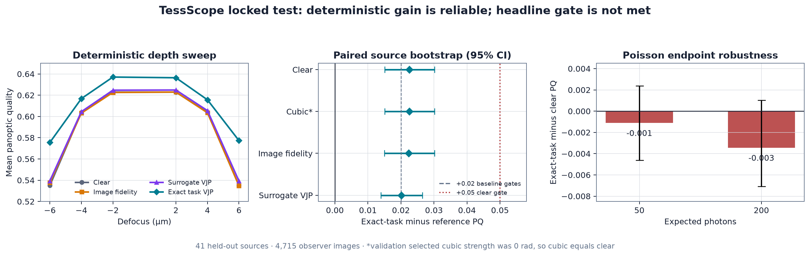
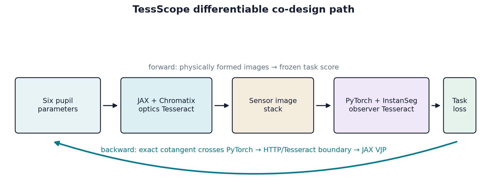

# TessScope

## V2.6 final status

The approved v2.6 diagnosis-first continuation is complete as a **negative training-only
experiment**. Controller and fixed-total-photon exposure audits did not show enough
corrected-PQ headroom. A separately preregistered sequential sensing/capture-mask route
then passed its full served derivative gate, but zero of 76 matched two-mask baselines and
zero of four exact endpoints met the frozen residual/first-frame soft gates.

Both exact starts completed four feasibility restorations and all 72 primary steps. No
candidate reached confirmation, hard validation, stopped-stage, derivative-free, or the
locked BBBC006 test. The test remains sealed. See
[the v2.6 result](outputs/v2_6/RESULTS.md).

## V2.5 final status

The approved v2.5 constrained B11 experiment is complete as a **negative
training/validation experiment**. The full served B11 feedback derivative passed with
`0.009022` relative error and `0.999887` cosine agreement. The registered 15-stage B11
and six-stage B7 primary matrices completed 378 exact aggregate steps, followed by six
capped SLSQP fallback runs because neither basis produced a primary-eligible endpoint.

Zero B11 candidates passed the frozen training and 12-well soft-validation gates. The
conditional piecewise, stopped-stage, hard, derivative-free, gain, and locked-test
branches were therefore not activated. The locked BBBC006 test remains sealed. See
[the v2.5 status](outputs/v2_5/STATUS.md).

## V2.4 final status

The approved v2.4 frozen-checkpoint audit is complete as a **negative expanded-hard
validation experiment**. It reconstructed all 270 saved v2.3 checkpoints without
retraining, found 90 that pass the unchanged soft ceiling, and froze three exact pupils
before inspecting hard labels. Three matched stopped-stage controls had exact forward
parity, and all six pupils received the same 45-well/27-dense-well hard protocol.

Every exact candidate gained more than `+0.01` first-frame hard PQ over clear, reached at
least `98.89%` direction accuracy and below `1.30 µm` focus MAE, and improved hard PQ
after correction. The best corrected PQ was `0.552295`, but its `+0.001285` gain over
piecewise-028 missed the required `+0.005`; its paired interval included zero. No
candidate advanced to derivative-free or locked-test evaluation. See
[the v2.4 status](outputs/v2_4/STATUS.md).

## V2.3 final status

The approved v2.3 closed-loop fallback is complete as a **negative validation-only
experiment**. The same B7 pupil now forms a first frame, drives a bounded frozen
autofocus action, and forms a corrected second frame; exact gradients pass through the
stage action with `0.004802` median relative error and `0.999967` cosine agreement.

All nine pre-registered profile/start runs completed (270 Adam steps). Every endpoint
reduced residual-defocus MAE, but every endpoint exceeded the frozen first-frame
segmentation-loss ceiling. The nearest endpoint missed by `0.002099`, so conditional
hard validation and the locked BBBC006 test were not run. See
[the v2.3 status](outputs/v2_3/STATUS.md).

## V2.1 final status

V2.1 completed the approved validation-only B7→B11 basis ladder with a **negative
pre-test result**. Basis/support and full served derivative gates passed, and the best
projected pupils improved hard off-focus PQ over clear with positive well-bootstrap
confidence bounds. No candidate simultaneously stayed within `0.01` of matched
segmentation-only and beat matched naive superposition on focus MAE. The locked BBBC006
test remained sealed. See [the v2.1 status](outputs/v2_1/STATUS.md) and
[causal audit](outputs/v2_1/AUDIT.md).

## V2 current status

The approved BBBC006 three-Tesseract v2 is implemented through hard validation, but it
is **not a completed positive result**. Calibration, signed autofocus, exact served
derivatives, matched baselines, joint optimization, and one-step stage correction all
work. However, no single pupil passed every frozen segmentation/focus compromise gate,
so the 48 locked test wells' images and labels were never loaded and no test metric was
run.

The closest focus-capable joint pupil gained `+0.0186` hard dense off-focus PQ over
clear, reached `100%` signed direction and `1.029 µm` MAE, and improved hard PQ after
one stage correction from `0.3552` to `0.4267`. It fell `0.0237` below
segmentation-only, exceeding the allowed `0.01` drop. A lower-focus refinement met the
segmentation-drop, direction, and MAE gates but did not Pareto-dominate naive
superposition. See [the v2 status](outputs/v2/STATUS.md).

## V1 continuity result

TessScope v1 is a completed, reproducible research prototype for task-aware microscope
optics. It optimizes a smooth six-parameter phase-only pupil through an actual
JAX/Chromatix image-formation model and a frozen PyTorch/InstanSeg nucleus observer.

The locked test found a statistically reliable deterministic improvement, but the
predeclared positive headline was **not** earned. Exact-task optics improved mean
off-focus panoptic quality (PQ) by `+0.0225` over clear, with a grouped 95% bootstrap
interval of `[+0.0151, +0.0302]`. The required clear-pupil gain was `+0.05`, count error
did not improve, and the two Poisson endpoints were not positive.



## What is implemented

- Exact InstanSeg `single_channel_nuclei` v0.1.2 raw-head and hard-label parity.
- BBBC039 evaluation decontaminated against disclosed BBBC038 observer training data.
- Chromatix optics with six bounded Zernike coefficients and validated PSF support.
- Frozen InstanSeg task loss and official hard-label endpoint.
- Two HTTP Tesseracts whose exact reverse pass crosses PyTorch back into JAX.
- Matched clear, cubic, image-fidelity, exact-task, and calibrated-surrogate designs.
- One-time locked deterministic and keyed-Poisson evaluation on 41 held-out sources.
- Grouped source-image bootstrap intervals, claim audit, demo figures, and tests.
- V2 BBBC006 z13–z19 data pipeline, well splits, registration, and reference-mask audit.
- V2 JAX optics, analytic NumPy/SciPy autofocus, and PyTorch InstanSeg Tesseracts.
- V2 matched multi-objective baselines and preserved negative pre-test gate evidence.
- V2.1 B7/B11 exact-gradient optimization, expanded 45-well hard validation, and frozen
  negative pre-test evidence without test leakage.
- V2.2 complete piecewise B7 frontier evaluation across 38 frozen candidates and 45
  validation wells, with a frozen negative matched-frontier decision.
- V2.3 two-exposure differentiable feedback, exact/stopped derivative evidence, and the
  complete nine-run soft optimization matrix with a sealed-test negative decision.
- V2.4 complete 270-checkpoint audit, three frozen early-stopped pupils, matched
  stopped-stage controls, expanded hard evaluation, and a sealed-test negative decision.
- V2.5 exact constrained B11 optimization, B7 continuity matrix, bounded SLSQP
  alternates, derivative evidence, and a sealed-test negative decision.
- V2.6 controller/exposure diagnosis, sequential two-mask feasibility review, three-way
  derivative gate, 76-pair matched screen, 72-step exact matrix, and sealed-test result.



## Key locked-test numbers

| Design | Mean off-focus PQ | Worst-depth PQ | Focus PQ |
|---|---:|---:|---:|
| Clear | 0.5873 | 0.5350 | 0.6270 |
| Cubic (selected 0 rad) | 0.5873 | 0.5350 | 0.6270 |
| Image fidelity | 0.5875 | 0.5349 | 0.6276 |
| Surrogate VJP | 0.5897 | 0.5393 | 0.6300 |
| Exact task VJP | **0.6098** | **0.5755** | **0.6405** |

The evaluation contains 41 decontaminated sources and 4,715 observer images. Full
results, limitations, and all frozen threshold checks are in
`outputs/TessScope-results.md`.

## Quick start on macOS

The project targets Python 3.12 and uses a project-local `uv` environment. It does
not need global Python packages.

```bash
uv sync
uv run python -m tessscope
uv run pytest
uv run ruff check .
```

The large datasets and model bundle are intentionally not committed. Their official
URLs, checksums, expected directory layout, and licenses are recorded in
`data/manifests/`. See `outputs/reproduction.md` before running the model-dependent
commands.

## Serve the differentiable chain

Open two terminals from the project root.

Terminal 1:

```bash
TESSERACT_API_PATH=services/optics/tesseract_api.py \
  uv run tesseract-runtime \
  --output-path artifacts/runtime-runs/optics serve --port 8401
```

Terminal 2:

```bash
TESSERACT_API_PATH=services/observer/tesseract_api.py \
  uv run tesseract-runtime \
  --output-path artifacts/runtime-runs/observer serve --port 8402
```

Then verify the real served reverse pass:

```bash
uv run python scripts/check_component_derivatives.py
uv run python scripts/check_served_derivative.py
```

The served gate passed with median relative error `0.0052` and cosine agreement
`0.99961` over its stable epsilon window.

## Project map

- `src/tessscope/`: data, optics, observer, optimization, and evaluation code.
- `services/`: JAX optics and PyTorch observer Tesseract entry points.
- `scripts/`: gated experiments, locked evaluation, and figure generation.
- `configs/`: frozen preprocessing, designs, contract, and pre-test hashes.
- `data/manifests/`: provenance, checksums, splits, and decontamination evidence.
- `tests/`: fast parity, derivative, optics, observer, and metric tests.
- `outputs/`: final readable results, figures, and reproduction guide.
- `plan.md` and `decision-log.md`: implementation checkpoint and decision trail.

## Scope

This is an optical co-design research prototype using digitally reimaged biological
texture. It is not a clinical or laboratory-performance claim. Third-party software,
model, and dataset terms remain with their original owners; see `NOTICE.md`.
