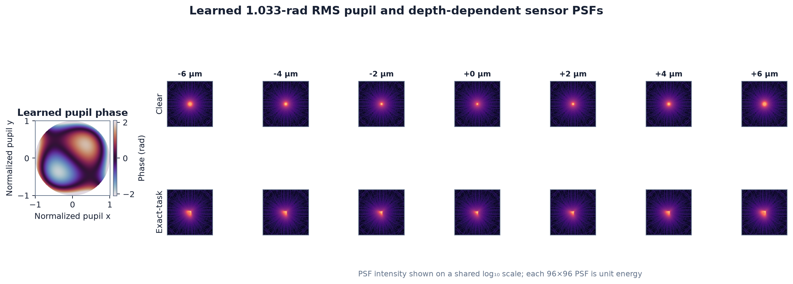
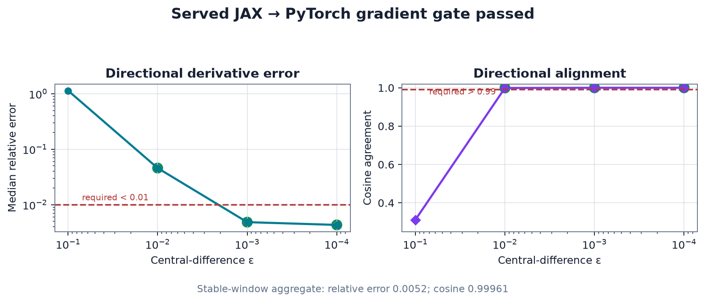
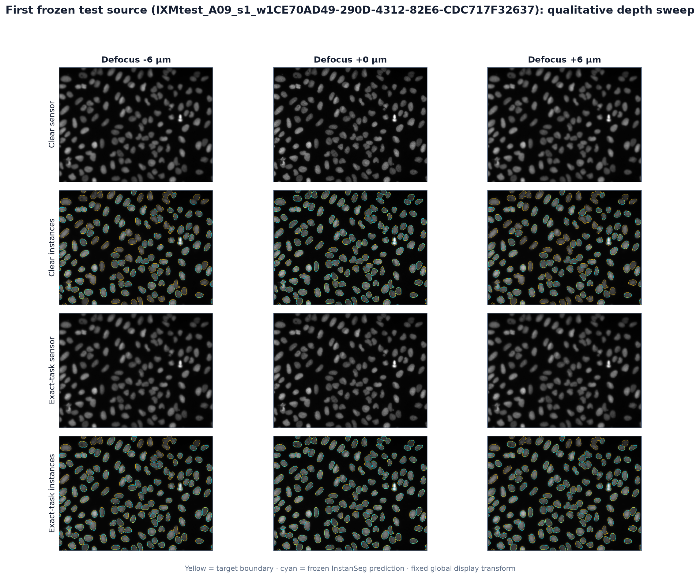

# TessScope locked-test results

## Outcome

TessScope produced a useful negative headline result with a strong positive sub-result.
The exact task gradient learned a `1.033 rad` RMS pupil that reliably improved
deterministic off-focus segmentation, but the complete predeclared positive claim did
not pass.

The exact-task design improved mean off-focus panoptic quality (PQ) from `0.5873` to
`0.6098`: an absolute `+0.0225` over clear. The grouped source-image bootstrap 95%
interval was `[+0.0151, +0.0302]`, so the deterministic gain is not explained by the
sampling interval. It nevertheless falls short of the frozen `+0.05` clear-pupil gate.

## Frozen evaluation

- Test sources: 41 non-overlapping, decontaminated BBBC039 images.
- Observer calls: 4,715 full-source images.
- Primary depths: `−6, −4, −2, +2, +4, +6 µm`.
- Focus at `0 µm` was diagnostic, not part of the primary mean.
- Photon diagnostics: `50` and `200` expected photons at `−6` and `+6 µm`, four keyed
  replicates per condition.
- Uncertainty: 1,000 paired bootstrap replicates resampling whole source images.
- Wall time on the target MacBook Air M2: 2,104 seconds (35.1 minutes).

## Deterministic metrics

| Design | Mean off-focus PQ | Worst-depth PQ | Focus PQ | F1 at IoU 0.5 | Foreground Dice | Absolute count error |
|---|---:|---:|---:|---:|---:|---:|
| Clear | 0.5873 | 0.5350 | 0.6270 | 0.7059 | 0.7900 | 15.1301 |
| Cubic | 0.5873 | 0.5350 | 0.6270 | 0.7059 | 0.7900 | 15.1301 |
| Image fidelity | 0.5875 | 0.5349 | 0.6276 | 0.7064 | 0.7907 | 15.1667 |
| Surrogate VJP | 0.5897 | 0.5393 | 0.6300 | 0.7106 | 0.7963 | 15.1545 |
| Exact task VJP | **0.6098** | **0.5755** | **0.6405** | **0.7383** | **0.8329** | 15.5122 |

The validation-selected cubic strength was `0 rad`, so the cubic baseline honestly
coincides with clear rather than being forced to use a harmful nonzero value.

## Exact-task paired PQ differences

| Reference | Mean difference | Grouped 95% CI | Frozen minimum | Passed? |
|---|---:|---:|---:|:---:|
| Clear | +0.0225 | [+0.0151, +0.0302] | +0.0500 | No |
| Cubic | +0.0225 | [+0.0151, +0.0302] | +0.0200 | Yes |
| Image fidelity | +0.0223 | [+0.0150, +0.0302] | +0.0200 | Yes |
| Surrogate VJP | +0.0201 | [+0.0139, +0.0265] | +0.0200 | Yes |

The exact VJP outperforming the forward-identical surrogate is the strongest
mechanistic result: the forward model and scalar task objective were the same, while
only the backward rule differed.

## Claim audit

| Predeclared check | Observed | Passed? |
|---|---:|:---:|
| Off-focus PQ over clear at least +0.05 | +0.0225 | No |
| Off-focus PQ over cubic at least +0.02 | +0.0225 | Yes |
| Off-focus PQ over image fidelity at least +0.02 | +0.0223 | Yes |
| Primary-reference CI lower bounds positive | All positive | Yes |
| Worst-depth PQ over clear at least +0.04 | +0.0405 | Yes |
| Focus PQ drop no worse than −0.03 | +0.0135 | Yes |
| Absolute count-error reduction at least 10% | −2.53% (worse) | No |
| Exact over surrogate at least +0.02 | +0.0201 | Yes |
| Exact-over-surrogate CI lower bound positive | +0.0139 | Yes |
| Positive at both photon levels | Both means negative | No |

Because three checks failed, TessScope does not make the frozen positive headline
claim.

## Photon robustness

At 50 expected photons, exact-task minus clear PQ was `−0.0011` with 95% CI
`[−0.0046, +0.0024]`. At 200 photons it was `−0.0034` with 95% CI
`[−0.0071, +0.0010]`. Both intervals cross zero, and neither mean is positive.

## Learned optics and gradient evidence

The selected exact-task pupil has `1.033 rad` RMS phase. The 96-pixel sensor support
retains a minimum `0.9973` of the matched larger-reference PSF energy, above the frozen
`0.995` requirement.

The actual JAX/Chromatix → HTTP/Tesseract → PyTorch/InstanSeg reverse path passed the
directional derivative gate. Its stable-window aggregate median relative error was
`0.0052`, and cosine agreement was `0.99961`.

## Non-cherry-picked qualitative example

This panel uses the first decontaminated test record in the frozen manifest, not a
source selected by score or appearance. Yellow boundaries are targets; cyan boundaries
are predictions from the official frozen hard endpoint.

## Limitations

- BBBC039 is digitally reimaged biological intensity texture, not a physical optical
  bench experiment or fluorophore ground truth.
- Results cover one dataset, one frozen InstanSeg observer, one phase family, and one
  matched optimization start.
- The learned optics improved PQ and Dice but slightly worsened absolute count error.
- The deterministic gain did not transfer to a positive mean gain at the two frozen
  Poisson endpoints.
- Validation selected a zero cubic strength, making cubic and clear identical.
- InstanSeg emitted one upstream maximum-iteration warning during the 4,715-image test
  matrix. The endpoint returned normally, every expected row was written, and no rerun
  or threshold change was made.
- This prototype is not a clinical, diagnostic, or laboratory-performance claim.
