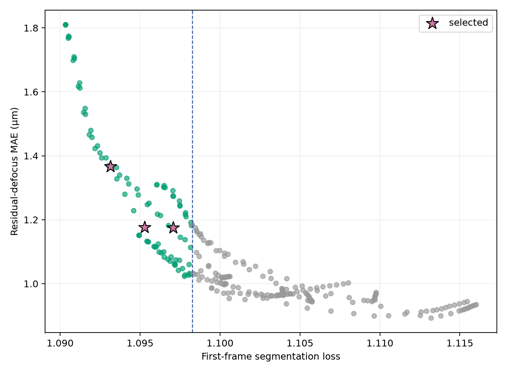

# TessScope v2.4 frozen-checkpoint audit

V2.4 evaluated every intermediate phase vector saved by the frozen v2.3 exact-gradient
runs. It did not rerun training, change the first-frame ceiling, inspect hard labels, or
touch the locked BBBC006 test.

## Audit integrity

- Source records: 270 checkpoints from 9 runs × 30 steps.
- Unique parameter hashes served: 269; one exact duplicate was cached and preserved under
  both source identifiers.
- Validation: the unchanged 12 wells in four deterministic batches.
- Soft-eligible checkpoints: 90.
- Globally nondominated canonical checkpoints: 57.
- Maximum step-30 reproduction error versus v2.3: `8.48e-8`.
- Minimum support-energy fraction across the complete pool: `0.997226` (required `0.995`).
- Test access: false.

## Frozen selection

| Exact checkpoint | First loss | Final loss | Residual MAE |
|---|---:|---:|---:|
| Balanced segmentation-only, step 14 | 1.097063 | 1.060280 | 1.174831 µm |
| Action-heavy segmentation-only, step 12 | 1.095286 | 1.060419 | 1.175803 µm |
| First-heavy segmentation-only, step 9 | 1.093136 | 1.060831 | 1.367156 µm |

The unchanged first-frame ceiling is `1.098270310640335`. All three selected checkpoints
are from distinct source runs and have distinct parameter hashes. They now advance to
matched stopped-stage optimization and expanded hard validation under the already frozen
v2.3 gates.

